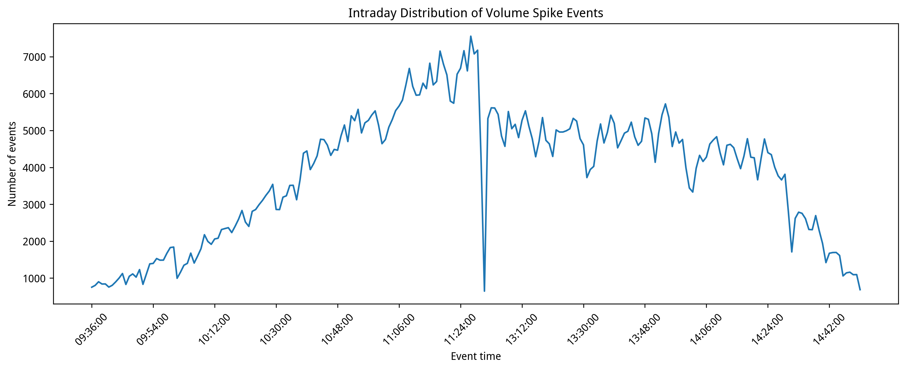
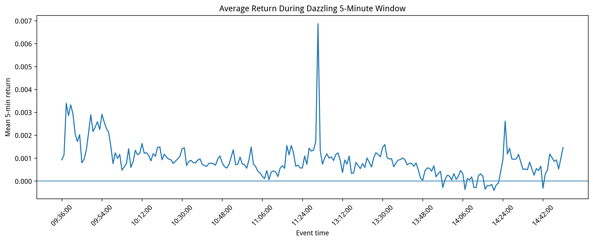
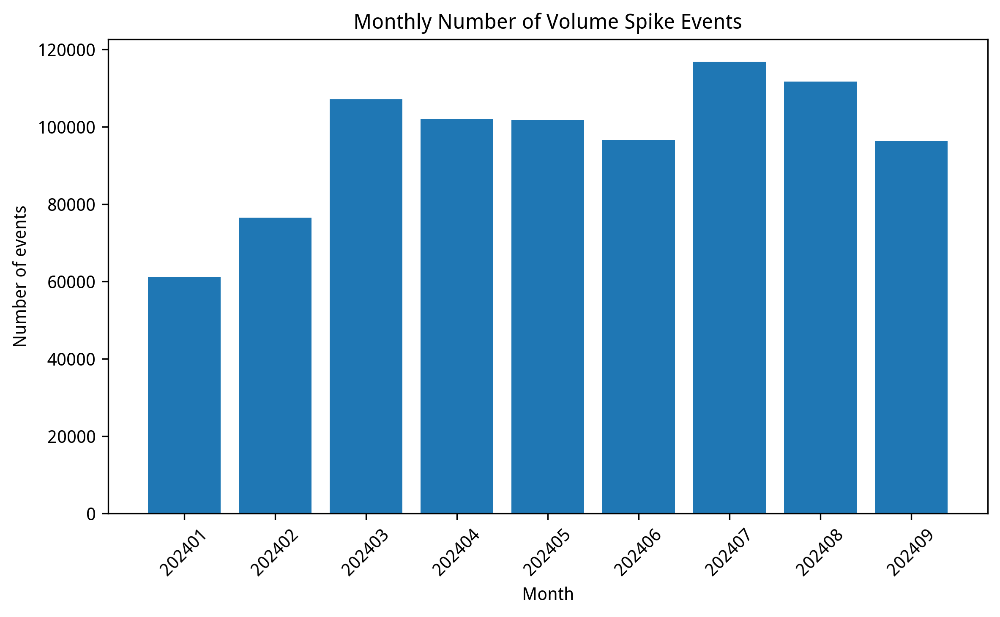
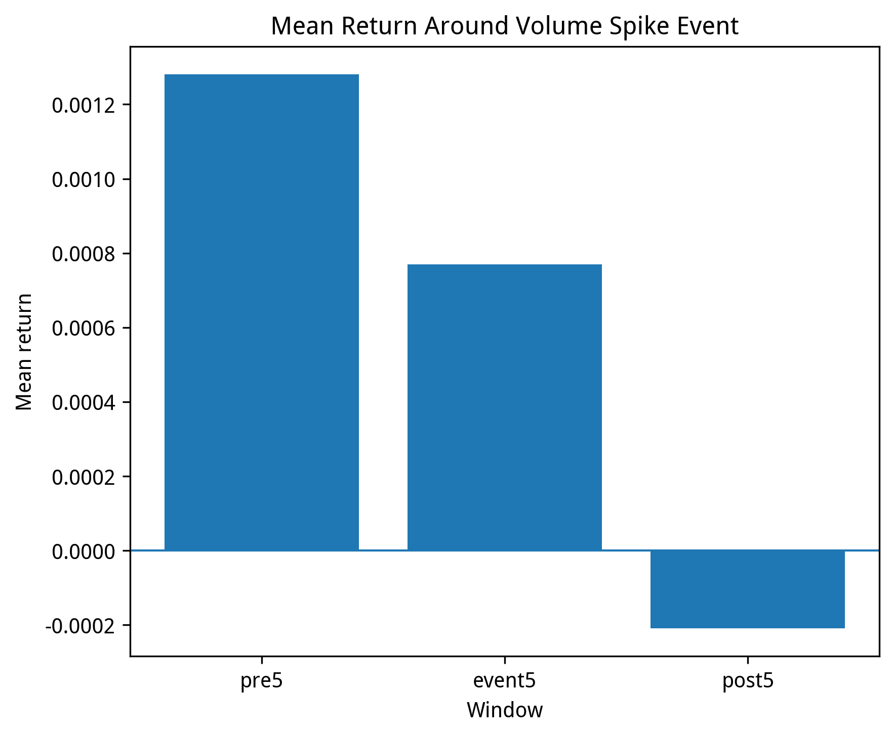

# 成交量激增与耀眼5分钟事件研究复现

## 1. 项目简介

本项目基于 A 股 1 分钟行情数据，复现成交量激增事件研究框架。核心目标是识别股票日内成交量异常放大的时刻，并围绕该时刻构造耀眼5分钟窗口，考察事件前、事件中、事件后的收益率、波动率和成交量特征。

## 2. 数据说明

- 数据来源：米筐 RQData
- 数据频率：1 分钟
- 样本区间：2024-01-01 至 2024-09-30
- 股票范围：A 股全市场样本
- 原始数据：由于数据授权限制，项目不公开原始分钟行情数据

## 3. 事件定义

对每只股票、每个交易日，定义成交量激增倍数：

spike_ratio = 当前1分钟成交量 / 过去20个交易日同一分钟成交量中位数

每只股票每天选择 spike_ratio 最大的分钟作为成交量激增事件时刻。

围绕事件时刻构造三个窗口：

- pre5：事件发生前5分钟
- event5：事件发生当分钟开始的连续5分钟，即耀眼5分钟
- post5：事件结束后的连续5分钟

## 4. 样本规模

- 事件数量：870058
- 股票数量：5128
- 交易日数量：171
- 样本起始日期：2024-01-16
- 样本结束日期：2024-09-30

## 5. 核心统计结果

| 指标 | 数值 |
|---|---:|
| 平均成交量激增倍数 | 70.801911 |
| 中位数成交量激增倍数 | 18.066667 |
| 事件前5分钟平均收益率 | 0.00128065 |
| 耀眼5分钟平均收益率 | 0.00076975 |
| 事件后5分钟平均收益率 | -0.00020989 |
| 耀眼5分钟平均 realized variance | 0.00007057 |
| 平均事件成交量占比 | 0.02963469 |

## 6. 核心图表

### 日内成交量激增事件分布

### 耀眼5分钟平均收益

### 月度事件数量

### 事件前后收益对比

## 7. 输出文件

主要输出文件包括：

- tables/summary_statistics_2024Q1Q3.csv
- tables/event_time_distribution_2024Q1Q3.csv
- tables/monthly_summary_2024Q1Q3.csv
- tables/volume_spike_events_2024Q1Q3_sample10000.csv
- figures/intraday_event_count.png
- figures/intraday_event5_return.png
- figures/monthly_event_count.png
- figures/mean_return_pre_event_post.png

## 8. 数据授权说明

本项目不上传原始分钟行情数据。若需要完全复现，用户需具备米筐 RQData 数据权限，并按照代码重新下载分钟行情数据。

Raw minute-level market data are not included due to data licensing restrictions.
